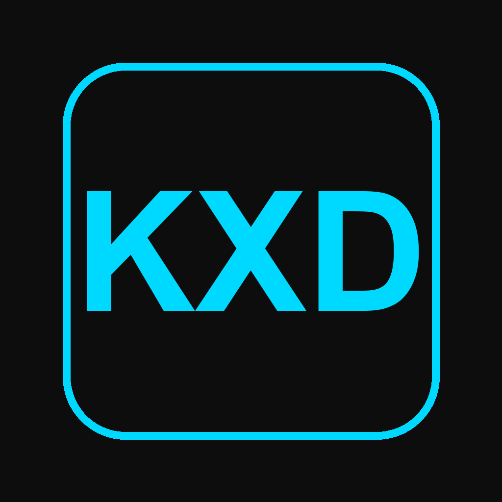

# KXD App Icon Implementation

## Overview

Custom app icon with "KXD" text has been successfully generated and integrated into the Electron app.

## Icon Design

**Visual Style:**
- Dark background (#0D0D0D) - matches dashboard theme
- Cyan text (#00D9FF) - matches dashboard accent color
- Rounded rectangle border in cyan
- Bold, modern typography
- Clean, professional appearance

**Preview:**


## Generated Files

All platform-specific icons have been created:

```
electron-app/assets/
├── icon.icns          # macOS app icon (all sizes)
├── icon.ico           # Windows app icon (multi-resolution)
├── icon.png           # Linux icon (1024x1024)
└── icon_*x*.png       # Individual PNG sizes (16-1024px)
```

## Icon Sizes

The following sizes were generated for multi-resolution support:
- 16x16, 32x32, 64x64, 128x128, 256x256, 512x512, 1024x1024

## Integration

The icons are automatically detected by electron-builder via the `package.json` configuration:

```json
{
  "build": {
    "mac": {
      "icon": "assets/icon.icns"
    },
    "win": {
      "icon": "assets/icon.ico"
    },
    "linux": {
      "icon": "assets/icon.png"
    }
  }
}
```

## Built App

The new icon is included in:
- **macOS**: `dist/KX Dashboard-1.0.0-arm64.dmg`
- **Dock/Launchpad**: Shows KXD icon
- **App Switcher (Cmd+Tab)**: Shows KXD icon
- **Finder**: Shows KXD icon

## How to Update Icon

If you need to change the icon in the future:

1. **Replace the icon files** in `assets/`:
   - `icon.icns` (macOS)
   - `icon.ico` (Windows)
   - `icon.png` (Linux)

2. **Rebuild the app**:
   ```bash
   cd electron-app
   npm run build:mac
   ```

## Technical Details

### Generation Process

Icons were generated using:
- **Python + Pillow**: Created base PNG images with text rendering
- **macOS iconutil**: Converted PNGs to .icns format
- **Python PIL**: Created multi-resolution .ico for Windows

### Color Matching

Icon colors match the dashboard design system:
- Background: `#0D0D0D` (same as dashboard background)
- Accent: `#00D9FF` (same as dashboard cyan accent)

This ensures visual consistency between the app icon and the dashboard interface.

## Installation

When users install the app:
1. The KXD icon appears in their Applications folder
2. The icon shows in the Dock when running
3. The icon appears in app switcher (Cmd+Tab)
4. The icon shows in menubar and notifications

---

**Note**: The app is unsigned, so users need to right-click → Open on first launch to bypass macOS Gatekeeper warnings.


